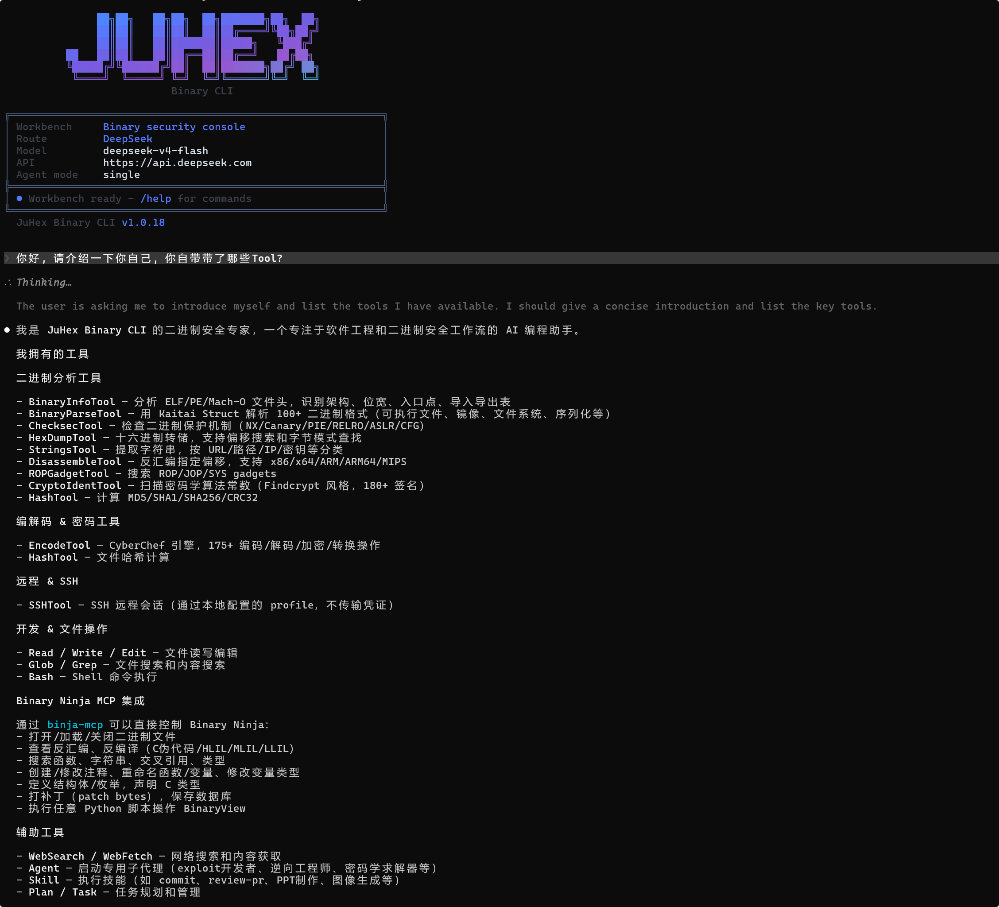
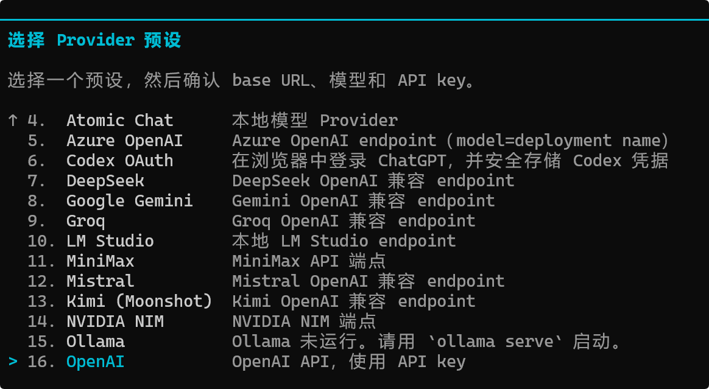
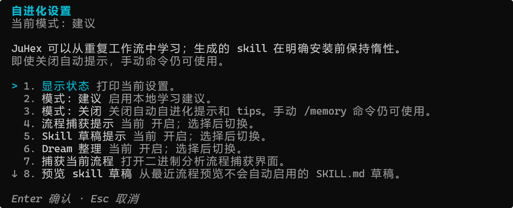
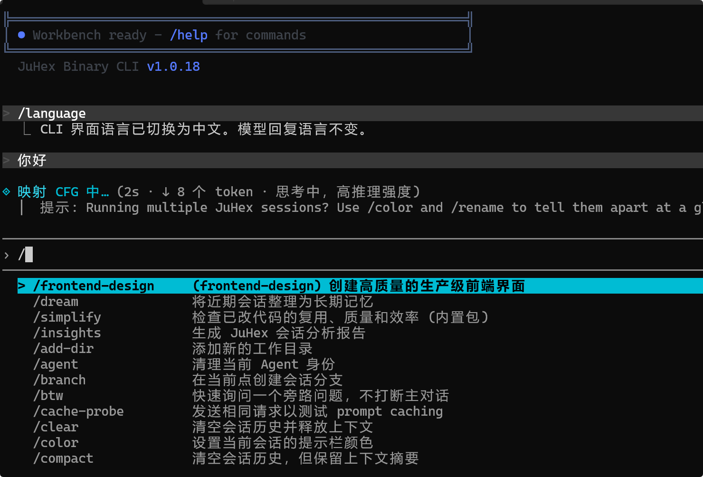
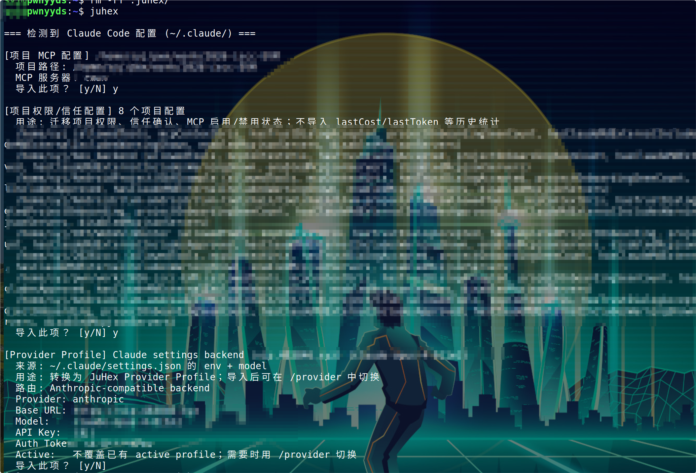
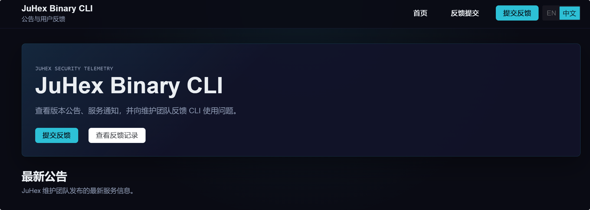

# JuHex Binary CLI: 二进制安全团队的 AI Agent 工作台

> 从漏洞挖掘到样本分析, 用对话式指令驱动完整工作流。一个终端, 承载所有安全能力。


---

## 安全研究员的日常, 大概是这样的

分析一个二进制程序, 你可能需要:

先跑 file 和 checksec 看基本信息, 再用反汇编器定位关键函数, 然后翻文档确认这个 glibc 版本下 tcache 的行为, 接着构造利用链, 最后写 exploit 脚本验证。

这个过程中, 你在终端、IDA、浏览器、笔记本之间来回切换。每一步的分析结果都在你脑子里串联, 但工具之间并不互通。

如果你在用 AI 辅助分析, 情况稍好一些 -- 但现有的 AI 编码工具都是面向通用开发设计的。它们能跑命令、读文件, 但不会主动按照安全研究的思路来: 拿到一个二进制, 应该先看什么保护? 这个漏洞模式通常怎么利用? 这个架构下有哪些可用的 gadget 类型?

你得一步步引导, 每次新会话都从头建立上下文。

JuHex Binary CLI 就是为这个场景设计的。



---

## 核心能力

### 1. 内置二进制安全专家知识

JuHex 内置了覆盖完整安全研究知识体系的专家 Prompt, 让模型开箱即具备专业认知:

- **基础知识**: x86/x64/ARM/MIPS 汇编与调用约定, ELF/PE/Mach-O/DEX 格式, 编译器模式识别
- **漏洞研究**: 栈/堆/格式字符串漏洞利用, ROP 链构造, 堆管理器内部机制, House of 系列攻击手法, glibc 版本差异感知
- **逆向工程**: 静态分析 (IDA/Ghidra/radare2), 动态分析 (GDB/WinDbg), 反反调试, VM 反混淆
- **恶意软件分析**: API 哈希识别, 字符串解密, 持久化机制, C2 通信模式

你不需要每次新会话都花时间 "教" 模型安全研究的思路。打开 JuHex, 给它一个二进制文件, 它已经知道应该先看什么、怎么分析、从哪里找突破口。

此外, JuHex 还内置了覆盖主流攻防技术的专家知识库。当模型在分析过程中遇到特定技术点, 知识库会自动检索相关内容并注入上下文 -- 比如检测到堆漏洞相关特征, 会自动补充对应的利用手法, 不需要你手动提供参考资料。知识库完全在本地运行, 注入量根据上下文窗口大小动态调整。

### 2. 12 个内置二进制分析工具

| 工具 | 做什么 |
|------|--------|
| BinaryInfo | 自动识别文件类型, 解析文件头、架构、依赖 |
| Checksec | 检测 ASLR、DEP、Canary、RELRO 等安全特性 |
| HexDump | 十六进制导出, 支持指定偏移和长度 |
| Strings | 智能字符串提取, 过滤噪声 |
| Disassemble | 多架构反汇编 (x86/ARM/MIPS) |
| ROPGadget | ROP Gadget 搜索, 辅助利用链构造 |
| EncodeTool | 编解码, 兼容 CyberChef 支持的主流格式 |
| BinaryParseTool | 深度解析 ELF/PE/Mach-O 嵌套结构 |
| CryptoIdent | 加密算法识别 |
| Hash | 多算法哈希计算 |
| SSHTool | 远程分析, 支持 SFTP + Shell 会话 |
| BinaryToolHelpTool | 按需工具帮助, 降低 token 消耗 |

这些工具 CLI 自带, 不需要额外安装。模型会根据分析上下文自动选择合适的工具组合 -- 拿到一个 ELF, 会先跑 BinaryInfo 和 Checksec, 再根据保护情况决定后续策略。

### 3. Skill 与 MCP 生态

JuHex Binary CLI 原生支持 Skill 工作流和 MCP 服务调用:

- **Skill**: 可复用的任务工作流, 将多步骤操作封装成一键执行的能力
- **MCP**: 通过标准协议接入外部工具和服务, 扩展 CLI 的能力边界

```bash
juhex mcp add <name> -- <command> [args...]
juhex mcp list
juhex mcp doctor    # 诊断连接状态
```

作为 JuHex 全系列安全产品的统一执行载体, Binary CLI 可以承载漏洞挖掘、样本分析、安全审计等多种场景的能力, 在同一个入口内完成。

### 4. 多 Provider 支持

```
/provider
```



JuHex 不绑定单一 AI 服务商。在配置中添加你的 AI 服务, 就可以自由切换:

- Anthropic (Claude)
- OpenAI
- DeepSeek
- Qwen / 智谱 / Kimi
- 本地模型 (Ollama / LM Studio)
- 以及任何 OpenAI 兼容 API

不同的模型适合不同的场景, JuHex 让你按需选择。更进一步, Multi 模式支持在同一个会话中为不同任务自动分配不同的 AI -- 这部分我们会在下一篇文章中详细展开。

### 5. 上下文压缩进化

分析一个复杂的二进制, 对话动辄几十轮。别的 AI 工具到后面就开始 "失忆" -- 前面分析的关键发现被截断, 你不得不反复粘贴。

JuHex 对上下文压缩做了专门的优化:

- **多阶段递进压缩**: 不是一刀切, 而是根据上下文紧张程度逐步加深压缩力度, 对话前期只做最轻量的摘要, 尽量不影响连续性
- **最近分析结果原文保留**: 压缩时会保护最近的对话原文不动, 确保你刚才的反汇编结果、工具输出不会被压缩掉
- **工具调用配对不切断**: 一个工具调用和它的返回结果始终作为整体保留, 不会出现 "调用了 Disassemble 但结果被截断" 的情况
- **压缩后自动重注入**: 压缩后会自动把关键上下文 (项目文件、工具说明、记忆) 重新注入, 并做去重处理
- **完全可观察**: 通过 `/context` 命令随时查看当前压缩状态, 整个过程透明

> 上下文压缩的优化研究了学术界在分层虚拟上下文管理、长上下文信息保留质量评测等方向的最新成果。

### 6. 跨会话记忆

安全研究经常跨天甚至跨周。今天分析到一半, 明天继续, 如果没有上下文沉淀, 新会话很容易丢失前面的判断、规则和分析习惯。

JuHex 的记忆系统用于把跨会话仍然有价值的信息保存在本地, 并在后续相关任务中召回:

- **项目规则**: 会优先加载 `JUHEX.md`、`AGENTS.md`、`CLAUDE.md` 和 `.juhex/rules/*.md` 中的项目约定
- **关键发现**: 可以将分析中的重要结论保存为本地 memory, 后续相关会话会按本地索引匹配召回
- **工作偏好**: 用户明确表达的偏好、纠正和长期习惯可以保存为本地记忆, 减少重复说明
- **可复用流程**: 二进制分析流程可以先保存为 procedure memory, 也可以生成 Skill 草稿; Skill 只有在用户显式晋升后才会成为可调用能力

记忆以本地 Markdown 文件和本地索引保存, 不使用托管 memory 服务, 也不会为本地召回调用远程 embedding。流程捕获、Skill 草稿和敏感内容有更严格边界: 流程和 Skill 需要用户显式保存或晋升, 密钥/凭据类内容会被阻止、脱敏或隔离。过期、隔离、删除或候选状态的记录默认不会参与召回, 可通过 `/memory` 命令审计和清理。

> 设计上借鉴了长期记忆生命周期管理、记忆分层、跨会话经验积累、以及记忆投毒防护与信任评估等思路。

### 7. 自进化: 越用越顺手

JuHex 会自动识别你的可复用工作模式并提示保存:

- 经常执行的操作序列 -> 提示保存为可复用流程
- 重复的工具调用模式 -> 建议生成 Skill 草稿
- 跨会话积累的经验 -> 后台整理并提示确认

**默认只提示, 不自动执行。** 通过 `/evolve` 命令控制:



```bash
/evolve status       # 查看当前进化设置
/evolve suggest      # suggest-only 模式 (默认)
/evolve off          # 关闭自进化
/evolve capture on   # 开启流程捕获建议
/evolve skills on    # 开启 Skill 草稿建议
/evolve dream on     # 开启后台记忆整理建议
```

> 自进化模式借鉴了分层记忆结晶、可复用工作流自动提取等思路。核心目标: 用得越多, 工具越懂你的分析习惯, 形成个人和团队的能力积累。

---

### 8. 中英文界面切换

JuHex 完整支持中英文界面切换, 一条命令即可切换:

```bash
/language zh    # 切换到中文
/language en    # 切换到英文
```

从帮助文档、权限提示、命令建议到 MCP 配置诊断, 全链路覆盖。技术名词、Provider 名称、模型 ID 等保留英文原文, 不做强制翻译。



---

## 终端原生, 去哪都能用

纯命令行交互, 不需要浏览器或图形界面:

- SSH 远程到服务器上直接用
- 嵌入自动化脚本和 CI/CD 流程
- 在任何有终端的地方都能跑

---

## 性能与部署

- **快速启动**: 启动时间优化到亚秒级
- **原生发布包**: 提供独立可执行文件, 无需依赖 Node.js 或 npm 环境
- **完全离线可用**: 支持气隙环境部署, 所有核心功能 (版本查看、文档、Provider 配置、MCP 管理) 均可离线运行, 不存在隐式的在线依赖
- **多平台支持**: Windows / Linux / macOS

对于有内网隔离要求的安全团队, 可以直接拷贝安装包到目标环境, 不需要联网。

---

## 数据与执行环境完全可控

- 自有品牌独立部署, 不依赖第三方服务的可用性和策略变更
- 遥测事件全量公开, 功能与遥测完全解耦, 关闭遥测不影响任何功能
- 支持配置纯本地模型, 数据完全不出网
- 知识库和工具链完全本地运行

对于处理敏感数据的安全团队来说, 这不是加分项, 是基本要求。

---

## 兼容迁移

如果你已经在用 Claude Code 或 Codex, JuHex 支持无缝迁移。首次启动时可选择性导入旧配置 (仅复制, 不修改原文件), 项目指令文件也能自动识别。



---

## 产品生态

JuHex Binary CLI 是 JuHex AI Agent 全系列产品的统一执行载体, 可联合使用的产品包括:

| 产品 | 场景 |
|------|------|
| JuHex AppAudit | 应用安全审计 |
| JuHex AppScan | 应用安全扫描 |
| Framework 0day 挖掘 | 框架级漏洞挖掘 |
| APK 样本分析 | Android 样本分析 |
| 工控漏洞挖掘 | 工控安全研究 |
| ...... | 更多场景持续扩展中 |

---

## 下载与反馈

**下载**: https://github.com/JuHexSecurity/JuHex-Binary-CLI-PUBLISH

**反馈与公告**: https://cliapi.juhexsec.com/

在反馈平台可以查看版本公告、服务通知, 并向维护团队提交使用问题。



---

## 总结

JuHex Binary CLI 不是在通用 AI 编码工具上加了几个安全功能。它从一开始就是为安全研究场景设计的:

- 内置完整的安全研究知识体系和 12 个专用分析工具
- 原生支持 Skill 与 MCP 生态, 承载 JuHex 全系列安全能力
- 长对话不丢关键信息, 跨会话记忆自动保留
- 多 Provider 自由切换, 不绑定单一服务商
- 终端原生, 数据完全可控

一个终端, 承载所有安全能力。

---

> 下一篇, 我们会详细介绍 Multi 模式 -- 如何在同一个会话中让不同 AI 各展所长, 自动路由、自动编排、自动共享上下文。
