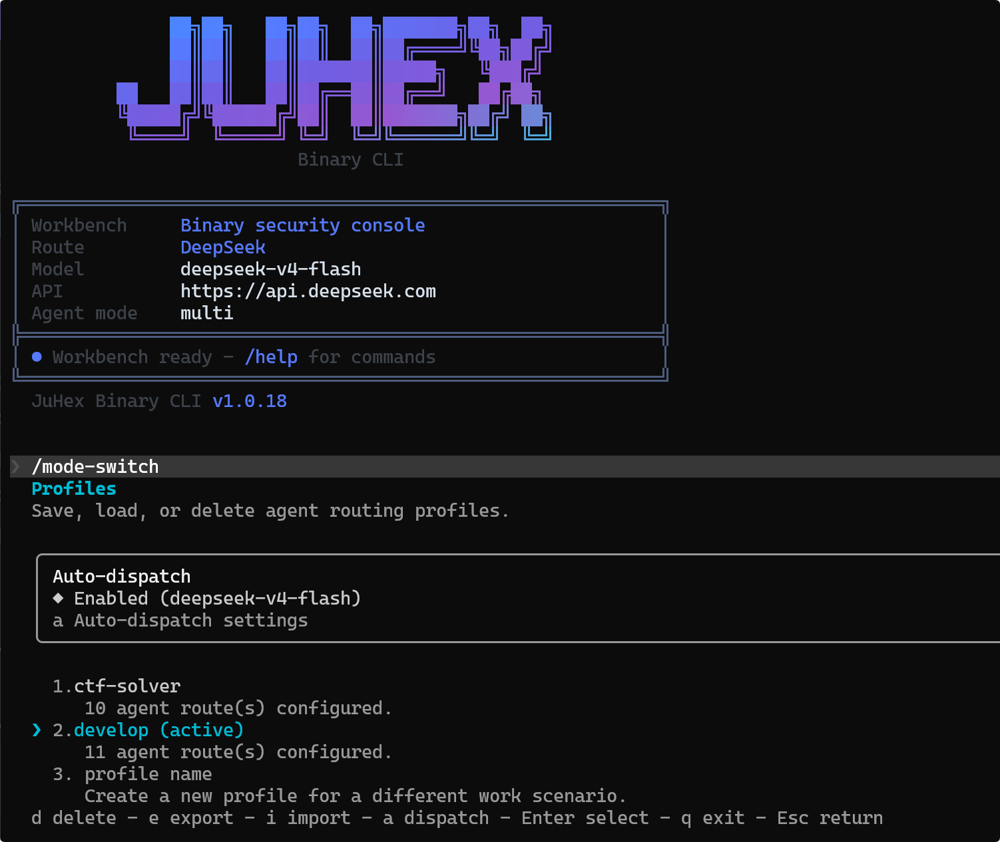
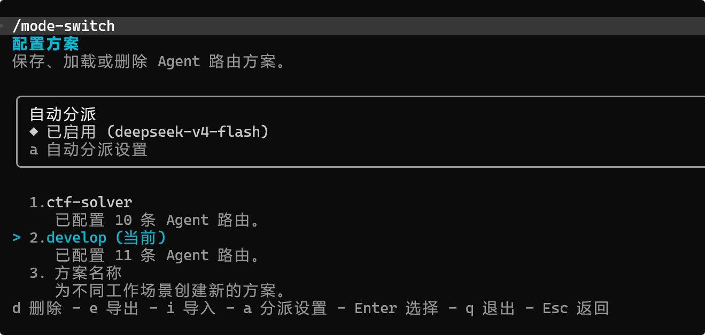
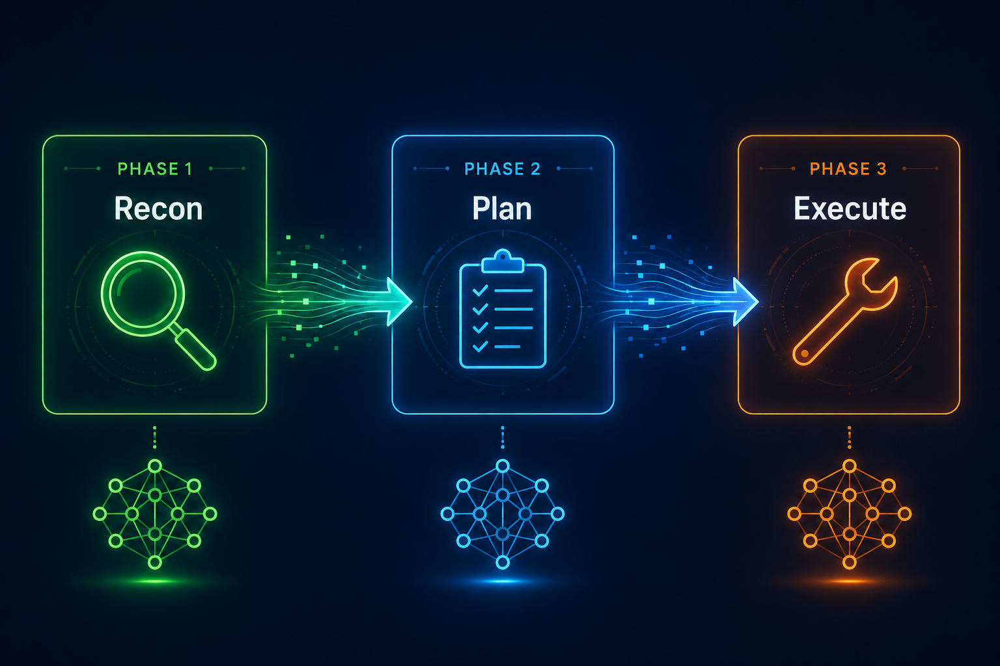

# 你是否也有这样的习惯: 审漏洞用 Codex, 写计划用 Claude?

> 不同的 AI 有不同的长处, 但在同一个终端里切换 Provider 一直是个难题。JuHex 的 Multi 模式让你在一个 CLI 里为不同任务指定不同的 AI, 自动路由、自动编排、自动共享上下文。



---

## 一个真实的开发日常

早上9点, 你打开终端, 准备开始一天的工作:

- **9:00** -- 需要快速扫描一个大型代码库, 找出所有可能的安全隐患。你用 DeepSeek, 便宜, 扫几百个文件不心疼。
- **10:30** -- 找到了几个可疑点, 需要制定修复计划和深度分析。你切到 Claude, 因为 Claude 做任务规划和多步推理特别强。
- **13:00** -- 计划定好了, 开始修 bug。你切到 GPT, 因为 GPT 在代码审计和 bug 修复上效率很高。
- **15:00** -- 遇到一个涉及复杂数学推导的加密算法, 需要验证。你切到 DeepSeek-R1, 因为它的数学推理能力突出。
- **16:30** -- 需要在内网环境做安全审计, 数据不能出网。你启动本地 Ollama。

五个任务, 五个工具, 五个终端窗口, 五份互不相通的上下文。

**这就是现状。** 而 Multi 模式想要解决的, 正是这个问题。

---

## Multi 模式是什么

JuHex 有两种运行模式:

| 模式 | 行为 | 适用场景 |
|------|------|---------|
| **Single** | 所有 Agent 使用同一个 AI | 日常编码, 单一 AI 足够 |
| **Multi** | 每个 Agent 绑定独立的 AI | 需要多 AI 协作的复杂任务 |

切换很简单, 会话中一条命令:

```bash
/mode-switch    # 交互式切换 Single / Multi 模式
```

也可以在启动时直接指定:

```bash
juhex --mode multi
```

在 Multi 模式下, 你可以定义多个 **Agent 身份**, 每个身份不只是绑定一个 AI 服务, 而是一套完整的 "角色定义":

| 可配置项 | 说明 |
|---------|------|
| `description` | 这个 Agent 擅长做什么 (自动路由的核心依据) |
| `prompt` | 专属的 System Prompt, 定义角色行为和知识边界 |
| `provider` / `model` | 绑定哪个 AI 服务和模型 |
| `tools` | 允许使用哪些工具 (可限制只读, 或只开放特定工具) |
| `skills` | 预加载的 Skill 工作流 |
| `maxTurns` | 最大对话轮数限制 |
| `memory` | 记忆作用域 (用户级 / 项目级 / 会话级) |
| `effort` | 工作努力级别 |

举个例子, 定义一个安全审计场景的 Agent 组合:

```json
{
  "modeSwitch": {
    "mode": "multi",
    "agents": {
      "explore": {
        "provider": "provider_deepseek"
      },
      "planner": {
        "provider": "provider_claude"
      },
      "coder": {
        "provider": "provider_gpt"
      },
      "reasoner": {
        "provider": "provider_deepseek_r1"
      },
      "offline": {
        "provider": "provider_local"
      }
    }
  }
}
```

使用 `/mode-switch` 切换到 Multi 模式后, 会进入交互式配置界面, 引导你完成 Agent 身份的创建和编辑 -- 包括选择 Provider、填写 description、配置工具权限等, 不需要手动编辑配置文件。



对于需要更精细控制的场景 (比如自定义 System Prompt、限制工具集、预加载 Skill), 也可以通过 `.juhex/agents/<name>.md` 文件定义完整的 Agent 身份:

```markdown
---
description: 快速探索和大范围扫描, 适合目录结构分析、字符串提取、批量文件检索
model: inherit
tools: [BashTool, FileReadTool, GrepTool, GlobTool]
effort: medium
maxTurns: 30
---

你是一个高效的探索型分析助手, 专注于快速定位目标...
```

不管是交互式配置还是文件定义, 每个 Agent 身份最终都是 **"用哪个 AI + 怎么用 + 能用什么工具 + 专注做什么事"** 的完整角色。

---

## 自动路由: 描述 + 模型能力, 综合选择最合适的 Agent

配好 Agent 身份之后, 你不需要每次手动指定用哪个。JuHex 会综合两个维度自动选择:

- **Agent 的 description**: 这个身份擅长做什么
- **绑定模型的能力特征**: Provider Profile 中标注的 tier、recommendedFor 等元数据

两者结合, 才能选出真正 "最合适的 Agent"。

比如你输入 "扫描这个项目的目录结构" -- description 匹配到 explore Agent ("快速探索和大范围扫描"), 同时 explore 绑定的 DeepSeek 标注了 `recommendedFor: "exploration"`, 双重匹配, 自动分配。

再比如你输入 "制定一个完整的审计计划" -- description 匹配到 planner Agent, 同时 Claude 标注了 `tier: "top"`, 适合需要深度推理的规划任务。

这意味着: **你定义的 description 越准确, Provider Profile 的元数据越完善, 自动路由越精准。**

自动路由只是建议, 你随时可以手动指定:

```
$explore 快速扫一下这个目录有哪些二进制文件

$coder 分析一下这个 use-after-free, 写个 exploit

$offline 这个文件不能出网, 帮我看看结构
```

用 `$` 加 Agent 名称作为前缀就行。前缀不会被发给模型, Agent 只看到实际任务描述。

---

## 复杂任务自动拆解

当任务足够复杂时 (比如 "帮我完整审计这个项目"), Multi 模式会自动将任务拆解为多个阶段, 每个阶段分配最合适的 Agent。

举个例子:

```
You: 审计这个 IoT 固件, 找出所有安全问题并给出修复方案
```

JuHex 会自动生成一个多阶段计划:



**Phase 1: 侦察** (explore Agent -> DeepSeek)
- 解析固件结构
- 提取字符串和符号
- 检测安全特性

**Phase 2: 制定分析计划** (planner Agent -> Claude Opus)
- 根据 Phase 1 的发现, 系统性拆解审计范围和优先级

**Phase 3: 漏洞分析与修复** (coder Agent -> GPT)
- 对可疑点做反汇编和漏洞分析, 构造 PoC, 编写修复代码

### 阶段之间的信息怎么传递?

这是 Multi 模式最关键的设计。不同 Phase 运行在不同的 AI 上, 但它们之间的分析结果会自动共享 -- Phase 1 在 DeepSeek 上发现的可疑函数列表, 会自动传递给 Phase 2 的 Claude, 再传递给 Phase 3 的 GPT, 不需要你手动复制粘贴。

同一阶段内的多个任务可以并行执行 (比如同时扫描多个模块), 不同阶段则顺序执行 (分析必须等侦察完成)。

如果某个任务失败了, 系统会检测到并报告原因, 你可以调整后重试, 而不是整个计划静默失败。

---

## 实战场景

### 场景一: 安全审计

| 阶段 | Agent | 模型 | 为什么选它 |
|------|-------|------|--------|
| 侦察扫描 | explore | DeepSeek | 低成本, 大量文件扫描不心疼 |
| 制定审计计划 | planner | Claude Opus | 任务规划能力强, 能系统性拆解审计范围 |
| 漏洞分析与修复 | coder | GPT | 代码审计和 bug 修复效率高 |
| 加密算法验证 | reasoner | DeepSeek-R1 | 数学推理强, 验证加密实现正确性 |

**核心价值**: 每个阶段用最擅长的模型, 不是所有事情都堆给同一个 AI。探索阶段用低成本模型大量试探, 规划用推理能力强的, 修复用编码效率高的。

### 场景二: CTF 夺旗

```
You: 解决这个 PWN 题目
```

| 阶段 | Agent | 模型 | 为什么选它 |
|------|-------|------|--------|
| 侦察 | explore | DeepSeek | 快速识别架构、保护机制、提取字符串 |
| 分析计划 | planner | Claude Opus | 根据保护情况制定利用策略 |
| 漏洞分析 | planner | Claude Opus | 反汇编关键函数, 深度推理定位漏洞点 |
| 数学推导 | reasoner | DeepSeek-R1 | 计算偏移、构造 ROP 链 |

分析过程中, 内置知识库会根据检测到的架构和漏洞类型自动注入相关利用技术 -- 比如检测到堆相关特征, 会自动补充堆利用手法, 不需要你手动翻资料。

### 场景三: 日常开发

Multi 模式不只是安全场景, 日常开发同样受益:

```
You: 重构数据库层, 从 MySQL 迁移到 PostgreSQL
```

| 阶段 | Agent | 模型 | 做什么 |
|------|-------|------|--------|
| 扫描现有代码 | explore | DeepSeek | 扫描所有 SQL 查询, 识别 MySQL 特有语法, 列出受影响的文件 |
| 制定迁移计划 | planner | Claude Opus | 根据扫描结果规划迁移顺序和风险点 |
| 逐文件改写 | coder | GPT | 按计划逐文件改写 SQL, 适配 PostgreSQL 语法 |

全程用高端模型的话, 第一阶段的大量文件扫描会消耗大量高价 token。用 DeepSeek 做探索, Claude 做规划, GPT 做改写 -- 各司其职, 成本和质量都有保障。

---

## 进阶能力

- **Failover 与负载均衡**: 一个 Provider Profile 可以配置多个 endpoint, 支持自动故障转移和加权负载均衡, 对于团队使用或有多个 API Key 的场景很实用
- **网络隔离**: 每个 Provider Profile 可以独立配置网络代理。比如公司内网的本地模型不走代理, 外部 API 走代理, Multi 模式下不同 Agent 自动使用各自的网络配置
- **分类器可定制**: 自动路由的分类决策可以指定一个低成本模型来执行 (比如 DeepSeek Flash), 分类本身不消耗高端模型额度

---

## 常见问题

**Q: Multi 模式会不会很慢?**

不会。自动路由的分类用的是轻量模型, 很快就能完成。实际执行的 AI 调用与 Single 模式相同, 不会有额外开销。

**Q: 不想自动路由, 能纯手动吗?**

可以。在配置中关闭 `autoDispatch`, 之后完全手动用 `$agent` 前缀选择:

```json
{
  "modeSwitch": {
    "mode": "multi",
    "autoDispatch": false
  }
}
```

**Q: 未配置的 Agent 用什么?**

跟随主会话的 Provider。也可以设置一个 default Agent 作为兜底。

---

## 快速开始

**1. 下载安装**

从 GitHub Release 下载对应平台的发布包:
https://github.com/JuHexSecurity/JuHex-Binary-CLI-PUBLISH

**2. 配置 AI 服务**

编辑 `~/.juhex/settings.json`, 添加你的 Provider Profile

**3. 启动 Multi 模式**

```bash
juhex
/mode-switch    # 选择 Multi, 交互式配置 Agent 身份
```

**4. 开始使用**

```
$explore 扫描这个项目
$coder 修复刚才发现的问题
```

---

## 总结

Multi 模式的核心理念很简单:

**不同的 AI 擅长不同的事, 与其在多个工具间来回切换, 不如让它们在同一个工作空间里各司其职。**

- 用 DeepSeek 做大范围探索 -- 快且便宜
- 用 Claude 做任务规划和深度推理 -- 思路清晰, 拆解到位
- 用 GPT 做代码审计和 bug 修复 -- 效率高, 改得准
- 用 DeepSeek-R1 做数学推理和算法验证 -- 逻辑严谨
- 用本地模型处理敏感数据 -- 安全且离线
- 复杂任务自动拆解为多阶段, 每阶段用最合适的 AI
- 阶段间分析结果自动传递, 不需要手动搬运

一个 CLI, 用尽每个 AI 的长处。

